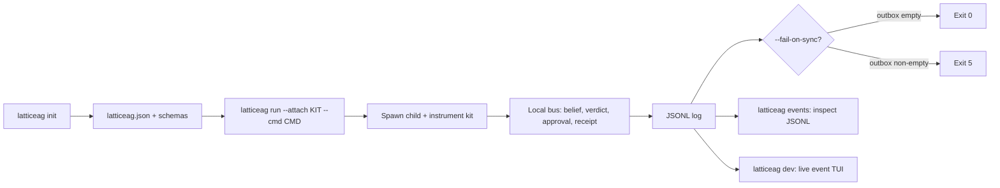

# LatticeAG latticeag-gateway 🧰

<p align="center">
  <a href="https://github.com/LatticeAG/latticeag-gateway/blob/main/LICENSE">
    
  </a>
  <a href="https://github.com/LatticeAG/latticeag-gateway/actions/workflows/ci.yml">
    
  </a>
  <a href="https://github.com/LatticeAG/latticeag-gateway/stargazers">
    
  </a>
  <a href="https://github.com/LatticeAG/latticeag-gateway/issues">
    
  </a>
  <a href="https://github.com/LatticeAG/latticeag-gateway">
    
  </a>
  <a href="https://nodejs.org/">
    
  </a>
</p>

<p align="center">
  <b>The LatticeAG stack as one command. Every product event, one schema.</b><br/>
  Install, wire, and run LatticeAG products as one local system.
</p>

<p align="center">
  <a href="#quick-start">Quick Start</a> ·
  <a href="#why-latticeag-gateway">Why latticeag-gateway</a> ·
  <a href="#how-it-works">How It Works</a> ·
  <a href="#features">Features</a> ·
  <a href="#configuration">Configuration</a> ·
  <a href="#file-tree">File Tree</a>
</p>

---

`latticeag` installs, wires, and runs LatticeAG products as one local system. Beliefs, diffs, verdicts, approvals, and receipts share a single versioned event model (`@latticeag/events`, currently `0.1.0`).

Built by [LatticeAG](https://github.com/LatticeAG).

## Why latticeag-gateway

- **One command for the whole stack** - scaffold, attach, execute, and observe every LatticeAG product without learning each repo's bespoke wiring.
- **One event schema** - beliefs, tool observations, verdicts, approvals, and receipts all validate against `@latticeag/events`. The `runs-on-latticeag` example asserts the chain order `belief < verdict < approval < receipt`.
- **Adapter-gated products** - the `products` catalog lists 19 products across the poly, lex, vek, axi, vis, and forge series with live adapter status (`available` vs `stub`).
- **Offline-first** - the local bus, JSONL log, fixture beliefs/approvals, and the reference demo run with no cloud dependency.
- **Machine-friendly** - `--json` puts machine JSON on stdout with diagnostics on stderr; `--quiet` silences everything but errors.

### How latticeag-gateway is different

- **Not a launcher script** - `latticeag run` attaches a real instrumentation kit (`openai-completions`, `openai-agents`, `hermes`, `langgraph`, `custom`) to a spawned command, streams product events to a JSONL log, and can fail the build (`--fail-on-sync`) when the sync outbox is non-empty.
- **Schema-versioned events, not log lines** - `codegen` regenerates types from the events package; `VERSIONING.md` governs the event contract.
- **Live TUI included** - `latticeag dev` runs with a live event TUI (`@latticeag/events-tui`) instead of tailing a file.

## Quick Start

```bash
# 1. Install prerequisites: Node >= 20.19, pnpm 9.15.0
node --version   # >= 20.19
pnpm --version   # 9.15.0

# 2. Install and build
git clone https://github.com/LatticeAG/latticeag-gateway.git
cd latticeag-gateway
pnpm install
pnpm build

# 3. Scaffold a project and check setup
latticeag init
latticeag doctor

# 4. Attach to an agent and run it
latticeag run --attach openai-completions --cmd "npx tsx src/agent.ts"

# Or install the CLI globally
pnpm add -g @latticeag/gateway
```

Verify with the offline reference demo (no API keys needed):

```bash
latticeag products          # 19 products, adapter status per row
latticeag doctor            # node, config, events package, adapters, env
```

## How It Works



## Features

### Core Commands

| Command | Description |
|---------|-------------|
| `latticeag init [dir]` | Scaffold a project (writes `latticeag.json` + wiring). |
| `latticeag run --cmd ... --attach KIT` | Attach an instrumentation kit and execute. Kits: `openai-completions` (default), `openai-agents`, `hermes`, `langgraph`, `custom`. |
| `latticeag dev` | Run with a live event TUI. |
| `latticeag events` | Inspect the JSONL event log. |
| `latticeag doctor` | Check node version, config presence/validity, events package, adapters, and env keys. |
| `latticeag products` | List the 19-product catalog with per-product adapter status. |
| `latticeag version` | Print CLI semver and workspace package versions. |

### Execution Options

| Feature | Description |
|---------|-------------|
| **Attach kits** | `--attach openai-completions\|openai-agents\|hermes\|langgraph\|custom`. |
| **Adapter overlays** | `--adapters <list>` as a temporary overlay; cannot enable an adapter absent from config. |
| **Timeouts** | `--timeout-ms <n>`; `0` means no timeout, otherwise SIGTERM at n, SIGKILL at n+5000. |
| **Resume** | `--run-id <ulid>` reuses a run id for resume of the JSONL only. |
| **Offline fixtures** | `--fixture-beliefs` (Axion adapter) and `--fixture-approvals` (VekInbox adapter) read fixtures instead of the network. |
| **Sync gate** | `--fail-on-sync` exits 5 if the sync outbox remains non-empty. |
| **Global flags** | `--config <path>`, `--cwd <dir>`, `--json`, `--quiet`, `--verbose`, `--no-color` (also honors `NO_COLOR`). |

### Packages

| Package | Version | Description |
|---------|---------|-------------|
| `@latticeag/gateway` | 2.0.0 | The `latticeag` binary. |
| `@latticeag/cli` | 2.0.0 | Deprecated compat shim; forwards to `@latticeag/gateway`. |
| `@latticeag/events` | 0.1.0 | The single versioned event model + codegen. |
| `@latticeag/config` | 0.1.1 | Config discovery, validation (`latticeag-config-v1` schema). |
| `@latticeag/bus` | 0.1.0 | Local event bus. |
| `@latticeag/core` | 0.1.0 | Shared core logic. |
| `@latticeag/events-tui` | 0.1.0 | Live event TUI for `latticeag dev`. |
| `@latticeag/adapter-axion` | 0.1.0 | Axion adapter (`available`). |
| `@latticeag/adapter-lexverdict` | 0.1.0 | LexVerdict adapter (`available`). |
| `@latticeag/adapter-vekinbox` | 0.1.0 | VekInbox adapter (`available`). |
| `@latticeag/adapter-viscompile` | 0.1.0 | VisCompile adapter (`available`). |
| `@latticeag/adapter-visreplay` | 0.1.0 | VisReplay adapter (`available`). |
| `@latticeag/adapter-stub` | 0.1.0 | Placeholder for products without a live adapter. |

## Configuration

`latticeag init` scaffolds a `latticeag.json` validated against `schemas/latticeag-config-v1.schema.json`. Config discovery walks up from `--cwd` (or cwd); `--config <path>` overrides via `LATTICEAG_CONFIG`.

```bash
latticeag init ./my-project
latticeag --cwd ./my-project doctor
latticeag --config ./my-project/latticeag.json products
```

`latticeag doctor` reports per-check rows (verified live):

```
pass  node_version        24.19.0
fail  config_present      not found     # until you run init
pass  events_package      0.1.0
warn  env_OPENAI_API_KEY  absent        # only needed for live kits
```

`latticeag run` also reads `--env-file <path>` via dotenv without overriding existing env vars. Hosted LexGateway relay is invite-only; everything else listed above runs locally.

## Verification

```bash
pnpm build       # pnpm -r build
pnpm test        # pnpm -r test (vitest across all packages + offline example)
pnpm typecheck   # pnpm -r exec tsc --noEmit
pnpm --filter @latticeag/events codegen
```

Test suite (verified): **177 passed, 0 failed across 42 test files and 13 packages** — including the offline end-to-end `runs-on-latticeag` fixture (`belief → verdict → approval → receipt` chain order asserted).

## File Tree

```
packages/
  cli/            latticeag binary (init, run, dev, events, doctor, products)
  cli-compat/     @latticeag/cli forwarding shim (@latticeag/gateway)
  events/         versioned event model + codegen + VERSIONING.md
  config/         config discovery + latticeag-config-v1 validation
  bus/            local event bus
  core/           shared core logic
  tui/            live event TUI (@latticeag/events-tui)
  adapters/       axion, lexverdict, vekinbox, viscompile, visreplay, stub
schemas/
  latticeag-config-v1.schema.json
examples/
  runs-on-latticeag/   offline fixture: run then assert-chain
pnpm-workspace.yaml
```

## Known Issues

- **Adapters are mostly stubs** - of 19 catalog products, 5 adapters report `available`; the rest run against `@latticeag/adapter-stub` until their live adapters land.
- **Hosted LexGateway relay is invite-only** - OSS covers the CLI, events schema, adapters, local bus, and reference demo.
- **Generated runtime state is gitignored** - `**/.latticeag/` and python caches are ignored; example runs recreate them.

## License

MIT — see [LICENSE](./LICENSE).
